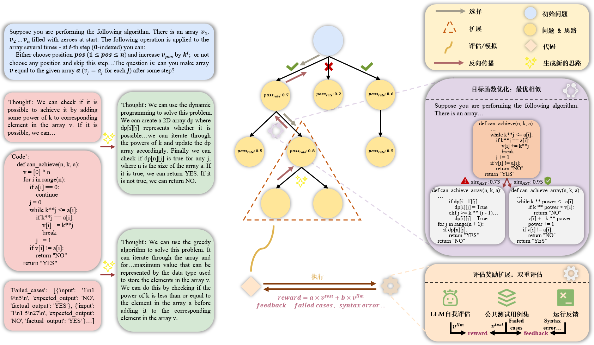

# GraduationDesign

毕设的一些代码

## Environment Setup
```bash
git clone https://github.com/SkyXJW/GraduationDesign.git
cd GraduationDesign
conda env create -n GraduationDesign -f environment.yml
conda activate GraduationDesign
```